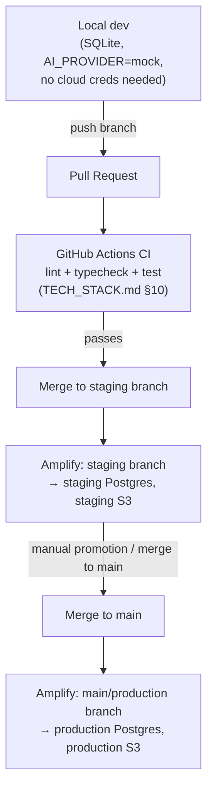

# Yorkstn — Deployment Architecture

**Phase:** 2 (Product & Architecture Design)
**Depends on:** `SYSTEM_ARCHITECTURE.md`, `TECH_STACK.md`, `SECURITY_ARCHITECTURE.md`
**Scope:** How the platform deploys, environment-by-environment, alongside the existing marketing site, and — per this project's "flag rather than fabricate access to infrastructure" discipline — an explicit list of what's already deployable in this environment versus what requires the user's team to provision new infrastructure/credentials.

---

## 1. Environments

Three environments, standard for a project this size — no additional environment tiers are justified at MVP:

| Environment | Purpose | Database | Hosting |
|---|---|---|---|
| **Local / dev** | Individual engineer development | SQLite (local file, per `TECH_STACK.md` §4) | `next dev`, no cloud deployment |
| **Staging** | Pre-production validation, QA, demoing to early customers | PostgreSQL (managed, separate instance from prod) | AWS Amplify, separate branch/app |
| **Production** | Live customer-facing platform | PostgreSQL (managed, production instance) | AWS Amplify, `main`/production branch |

Amplify natively supports multiple environments via **branch-based deployments** — connecting a `staging` branch to a separate Amplify app/environment with its own environment variables, and `main` (or a dedicated `production` branch) to the production environment. This requires no new deployment tooling, only Amplify console configuration once a staging AWS environment (database, S3 bucket) exists — see the checklist in §6.

---

## 2. One app, one build: the platform deploys alongside the marketing site, not separately

**The platform section is not a separate deployment.** It ships as new routes inside the same Next.js application that already serves the marketing site, built and deployed by the same `amplify.yml` pipeline (`npm ci` → `next build`, artifacts from `.next`). This is a direct consequence of the modular-monolith decision in `SYSTEM_ARCHITECTURE.md` §1 and is the right call here specifically because:

- Next.js App Router is designed to host multiple route groups (`app/(marketing)/**`, `app/app/**`, `app/partner-portal/**`, `app/api/**`) in one build without them interfering — there's no framework-level reason to split them.
- A separate deployment would mean standing up a second Amplify app, a second CI/CD path, and — most importantly — solving cross-app auth/session sharing for no actual benefit, since the marketing site has no authenticated area to isolate from and the platform's routes are already access-controlled by NextAuth.js middleware, not by deployment boundary.
- `amplify.yml` needs no structural change: `appRoot: yorkstn` and `next build` already build whatever routes exist in the app directory. The only additions are environment variables (§4) the new routes need at runtime (`DATABASE_URL`, `NEXTAUTH_SECRET`, S3 credentials, `AI_PROVIDER`, etc.) — set in Amplify's environment variable configuration per environment, not in `amplify.yml` itself.
- Routing: `app.yorkstn.com` (or `/app` in MVP, per `INFORMATION_ARCHITECTURE.md` §1) can be served either as a subdomain routed to the same Amplify app (via a custom domain + rewrite, if the team wants a distinct subdomain for the authenticated area) or simply as the `/app` path prefix within the existing domain — both are compatible with "one app, one build"; the choice between subdomain and path-prefix is a DNS/branding decision for Phase 4, not an architectural one.

**When a separate deployment would be justified (and isn't, here):** if the platform needed independent scaling, a different runtime, or a different release cadence from the marketing site — none of which apply at MVP. Revisit only if a specific module is later extracted per `SYSTEM_ARCHITECTURE.md` §1's stated extraction path.

---

## 3. Deployment flow

CI (lint/typecheck/test, per `TECH_STACK.md` §10) gates merges via GitHub Actions on pull requests; Amplify's own build (`npm ci && npm run build`) then runs at deploy time on push to the connected branch, as it does today for the marketing site. No change to the fundamental Amplify trigger model — only an added pre-merge gate and, once staging infrastructure exists, an added branch/environment mapping.

---

## 4. Environment variables and secrets strategy per environment

| Variable | Local/dev | Staging | Production |
|---|---|---|---|
| `DATABASE_URL` | SQLite file path | Staging Postgres connection string (Amplify env var / Secrets Manager) | Production Postgres connection string (Secrets Manager) |
| `NEXTAUTH_SECRET` | Local dummy value (`.env.local`, git-ignored) | Real random secret, Amplify env var | Real random secret, Secrets Manager, rotated periodically |
| `NEXTAUTH_URL` | `http://localhost:3000` | Staging domain | Production domain |
| `AI_PROVIDER` | `mock` (default — no key exists in this environment) | `mock` until a real key is provisioned, then `claude` | `claude` once provisioned |
| `ANTHROPIC_API_KEY` | Not set (mock provider doesn't need it) | Not set until provisioned | Secrets Manager, once provisioned |
| `AWS_S3_BUCKET` / IAM creds | Local disk stub or MinIO emulator (optional) | Staging bucket, Amplify env var / IAM role | Production bucket, Secrets Manager / IAM role |
| `SES_*` (existing) | Already required today for contact form | Existing pattern, extended | Existing pattern, extended |
| `SENTRY_DSN` (if adopted, §7) | Not set / local-only mode | Staging project DSN | Production project DSN |

Per `SECURITY_ARCHITECTURE.md` §4: local secrets live in `.env.local` (git-ignored); staging/production secrets live in Amplify's environment variable configuration for lower-sensitivity values and AWS Secrets Manager for higher-sensitivity ones (DB credentials, `NEXTAUTH_SECRET`, real LLM key). Nothing here requires a new secrets-management product beyond what AWS already offers, consistent with the AWS-centric stack already in place.

---

## 5. Database migration strategy: Prisma Migrate

- **Local:** `prisma migrate dev` — generates and applies migrations against the local SQLite database interactively during development.
- **Staging/production:** `prisma migrate deploy` — applies already-generated, committed migration files (not `migrate dev`'s interactive/destructive-reset behavior) as a deploy-time step. Recommended as an explicit step in the Amplify build (`preBuild` or `build` phase, e.g., `npx prisma migrate deploy && npm run build`) so schema changes land automatically when a PR containing a new migration merges — while remaining reviewable in the PR diff (migration SQL files are committed to the repo, so a reviewer sees exactly what schema change is about to run in production, rather than migrations being auto-generated invisibly at deploy time).
- Migrations should be additive/backward-compatible where possible in a live system (e.g., add-column-then-backfill-then-drop-old-column across two deploys, rather than a single breaking rename) once there is real production data to protect — for MVP's earliest stage before real customer data exists, this discipline matters less but should be adopted as a habit early rather than retrofitted later.
- Seed data (the curated corpus for `AI_ARCHITECTURE.md`'s RAG retrieval, compliance rule tables, demo organizations for local dev) is managed via Prisma's seed script mechanism (`prisma db seed`), kept separate from migrations themselves.

---

## 6. Rollback strategy

- **Application code:** Amplify keeps build history; rolling back the application to a previous build is a redeploy of a prior commit/build artifact — standard Amplify capability, no new tooling needed.
- **Database migrations:** Prisma does not auto-generate "down" migrations by default. Recommended MVP discipline: prefer additive migrations (§5) that don't require a destructive rollback in the first place; for the rarer case where a migration must be reverted, write and commit an explicit down-migration SQL file alongside the up-migration before deploying, so a rollback path exists rather than being improvised under pressure during an incident.
- **Combined rollback:** because application code and schema deploy together (one build, one `migrate deploy` step), a rollback should treat the pair as a unit — reverting application code without also reverting an incompatible schema change (or vice versa) risks a broken deploy. Keep migrations backward-compatible with the immediately-prior application version specifically so a code-only rollback (the common case) doesn't require a matching schema rollback.

---

## 7. Monitoring and observability

**Recommendation, appropriate for MVP scale — not an enterprise observability stack:**
- **Amplify's built-in build/deploy logs and hosting metrics** as the baseline — already available today with zero new setup, sufficient for basic uptime/deploy visibility.
- **Sentry** (or a comparable lightweight error-tracking service) for application-level error tracking (unhandled exceptions in Route Handlers/Server Components, client-side errors) — a small, well-integrated Next.js SDK addition, appropriate for a small team that needs to know when something breaks in production without operating a full observability platform (e.g., Datadog-scale tooling would be disproportionate at this stage).
- **Requires credentials:** a Sentry account/project (or equivalent) does not exist in this environment and must be created — flagged below, not fabricated.
- Structured application logging (e.g., a consistent `logger.error(...)` pattern with request/organization context) is a reasonable low-cost addition alongside Sentry, without needing a dedicated log-aggregation service (e.g., a hosted ELK/Datadog Logs) at MVP scale — Amplify/CloudWatch's default log capture is sufficient starting point.
- Revisit trigger: if the team needs performance tracing (not just error tracking), APM-style tooling (Sentry Performance, or similar) can be added later — not needed to ship MVP.

---

## 8. What's deployable now vs. what requires new infrastructure

Per this project's discipline of flagging rather than fabricating access to infrastructure it doesn't have, here is the explicit split:

### Deployable today, with zero new credentials
- Local development against SQLite (`TECH_STACK.md` §4).
- The `mock` AI provider (`AI_ARCHITECTURE.md` §5) — full AI Output Standard behavior, RAG-shaped retrieval against the seed corpus, deterministic scoring engines — all functional without any LLM API key.
- Local file-storage stub (or a local MinIO emulator) standing in for S3 during development.
- Authentication flows against NextAuth.js + the local SQLite database.
- Existing AWS SES-based email (already configured for the contact form) can be extended to platform notifications using the same existing credentials, if they remain valid — no new provisioning needed for this piece specifically.
- CI (GitHub Actions lint/typecheck/test/build) — needs only a GitHub Actions runner, which is available by default on any GitHub repo. Implemented at `.github/workflows/ci.yml` (Milestone 8) — runs entirely on the `mock` AI provider, local document storage, and a throwaway SQLite file, so it needs zero repository secrets.

### Requires Yorkstn's team to provision new infrastructure/credentials

| Item | Why it's needed | Blocks |
|---|---|---|
| **Managed PostgreSQL instance** (staging + production, e.g., AWS RDS/Aurora Serverless) | SQLite is local-dev-only; production needs real relational hosting, `pgvector`, full-text search | All staging/production platform functionality |
| **S3 bucket + scoped IAM credentials** (staging + production) | Document Management and Partner verification uploads have no real storage target otherwise | Document Management (2.6), Partner verification (3.5) |
| **AWS Secrets Manager configuration (or confirmed use of Amplify's encrypted env vars)** | Higher-sensitivity secrets (DB creds, `NEXTAUTH_SECRET`, LLM key) need managed storage in staging/prod | Secure staging/production deploys |
| **`NEXTAUTH_SECRET` (real, environment-specific value) and any OAuth provider credentials, if social login is desired** | Session security depends on a real secret per environment | Authentication in staging/production |
| **Real LLM API key (recommended: Anthropic Claude, `ANTHROPIC_API_KEY`)** | Without it, `AI_PROVIDER` stays `mock`; Category (a) features in `AI_ARCHITECTURE.md` stay seed-data-driven rather than truly generative | Real (non-mock) AI Market Intelligence narrative generation |
| **Sentry account/project (or equivalent error-tracking service)** | No error-tracking exists in this environment today | Production error visibility beyond Amplify's basic logs |
| **A staging AWS environment distinct from production** (separate DB instance, separate S3 bucket, separate Amplify branch/app config) | Needed to have a real staging tier per §1, not just a naming convention | The staging environment itself |
| **Licensed/external data sources flagged in `AI_ARCHITECTURE.md` §4** (real-time competitor pricing, live BIS certification status, live footfall data, live CRE benchmarks, a GST/e-invoicing GSP partner integration) | Explicitly out of MVP reach; requires vendor licensing/business decisions, not just engineering | Category (d) features — MVP ships these as clearly-labeled seed/manual data instead |

This list is the concrete "credentials/infra Yorkstn's team needs to provision" checklist referenced across `TECH_STACK.md` and `SECURITY_ARCHITECTURE.md` — Phase 4 implementation should treat each row as a tracked provisioning task, not something to work around by fabricating a connection or hardcoding a placeholder credential into committed code.
