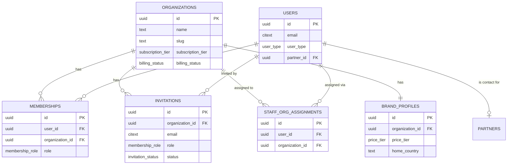
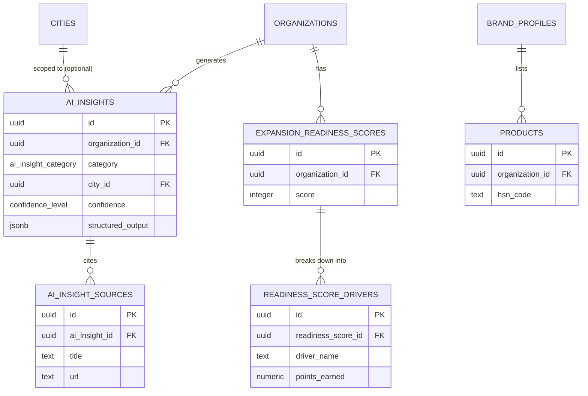
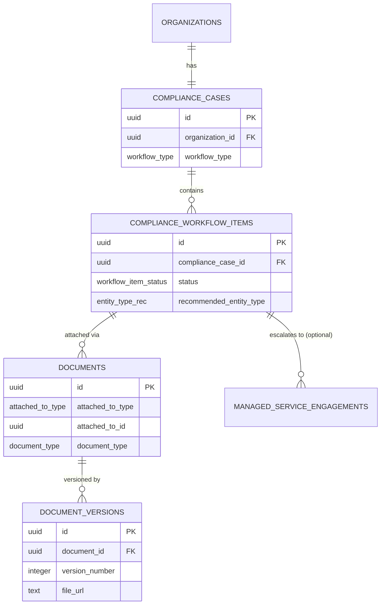
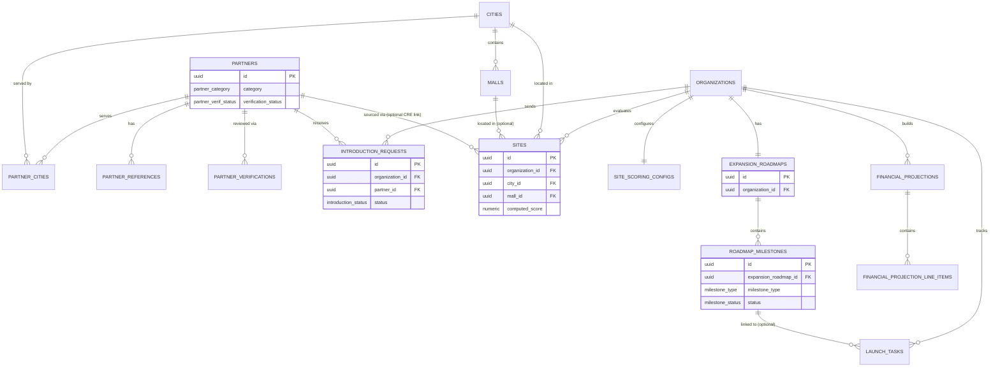

# Yorkstn — Entity Relationship Diagram

**Depends on:** `DATABASE_SCHEMA.md` (source of truth for column-level detail — this document visualizes its relationships and must be kept in sync with it, not treated as an independent design).

Rendered as four clustered Mermaid `erDiagram` blocks rather than one monolithic diagram — `DATABASE_SCHEMA.md` §1 groups tables into six sub-sections (Identity & Tenancy, Brand Profile, AI Market Intelligence, Compliance OS, Partner Discovery, Retail Expansion Intelligence) and a single diagram of all ~33 tables would be unreadable. Cross-cluster relationships (the FKs that connect one cluster to another) are called out in prose under each diagram instead of drawn twice.

---

## 1. Identity & Tenancy cluster

**Reading this cluster:** `users` is the single identity table for all three `user_type` values (`org_user`, `yorkstn_staff`, `partner`); which cluster a user can touch is determined by which join table has a row for them (`memberships` for org users, `staff_org_assignments` for staff, `partners.contact_user_id`/`users.partner_id` for partners) — see `AUTH_RBAC.md` for how this is enforced, not just modeled.

---

## 2. AI Market Intelligence cluster

**Reading this cluster:** `ai_insights` is append-only and category-discriminated (one table serving six of the seven Module 1 features per `DATABASE_SCHEMA.md` §1.3's design-decision note); `expansion_readiness_scores` is deliberately a separate, structurally distinct table from `ai_insights` because it is deterministic output, never a generative one — this separation is a modeling choice that encodes a product requirement (`FEATURE_SPECIFICATIONS.md` §1.7), not an accident of normalization.

---

## 3. Compliance Operating System cluster

**Reading this cluster:** `documents.attached_to_id` is a polymorphic reference (no DB-level FK — see `DATABASE_SCHEMA.md` §1.4) so the same Document Management feature serves both Compliance workflow items and Partner verification uploads without duplicating the table; this is drawn as a plain relationship line here for readability, but it is **application-enforced, not database-enforced** — a detail Phase 4 implementation must not lose.

---

## 4. Partner Discovery & Retail Expansion Intelligence cluster

**Reading this cluster:** `partners` and `cities`/`malls` are the two shared, non-tenant-scoped reference directories in the schema (per `DATABASE_SCHEMA.md`'s multi-tenancy exception list) — every other table here is `organization_id`-scoped. `roadmap_milestones.depends_on_milestone_id` (a self-referencing FK, omitted above for diagram readability) is what makes the Expansion Roadmap "dependency-aware" per `FEATURE_SPECIFICATIONS.md` §4.4.

---

## 5. Cross-cluster relationships (not re-drawn above)

- `ai_insights.requested_by_user_id` → `users.id`
- `compliance_workflow_items` ← read by → `expansion_readiness_scores.inputs_snapshot` (application-level aggregation, not an FK — the Readiness Score's compliance-completion driver is computed by querying Compliance OS state, not by a stored relationship)
- `managed_service_engagements.linked_compliance_item_id` → `compliance_workflow_items.id` (nullable — only set when requested from within a workflow, per US-50)
- `notifications.user_id` → `users.id`, fanning out from events across every other cluster (compliance deadlines, partner recommendations, engagement updates, introduction status changes, staleness alerts, invitations)
- `audit_logs.actor_user_id` → `users.id`, `audit_logs.organization_id` → `organizations.id` (nullable, for platform-level admin actions) — `audit_logs` conceptually references every mutable entity in every cluster via `(entity_type, entity_id)`, deliberately not modeled as a real FK to keep the audit table decoupled from schema evolution elsewhere.
