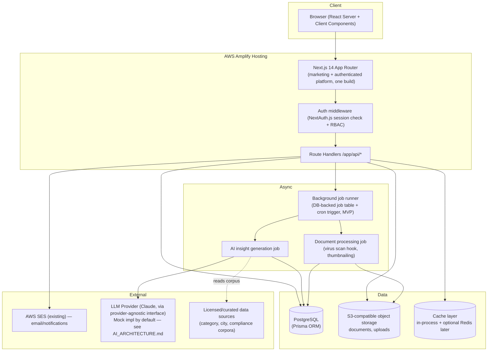

# Yorkstn — System Architecture

**Phase:** 2 (Product & Architecture Design)
**Depends on:** `PRD.md`, `FEATURE_SPECIFICATIONS.md`, `INFORMATION_ARCHITECTURE.md`
**Scope:** The authenticated platform (`/app` or `app.yorkstn.com` per `INFORMATION_ARCHITECTURE.md`), built as a new section of the existing Next.js repo. The public marketing site is unaffected and is out of scope for this document except where the two share infrastructure (hosting, CI/CD, email).

This document defines the end-to-end system topology for the platform Phase 4 will implement. Where a decision depends on infrastructure Yorkstn has not yet provisioned (a production database, object storage, a real LLM key), that dependency is flagged explicitly rather than assumed.

---

## 1. Architectural style: modular monolith, not microservices

**Decision: build the platform as a modular monolith inside the existing Next.js application, not as a set of independently deployed microservices.**

Reasoning, argued against the specifics of this project rather than in the abstract:

- **Team size.** This is built by a small team (effectively one to a handful of engineers at MVP). Microservices' main payoff — independent scaling and independent deployment of components owned by different teams — has no team boundary to attach to here. There is no "partner discovery team" and "compliance team" that need separate release cadences.
- **Existing repo constraint.** The task explicitly requires extending the current Next.js repo, not starting a new one. Next.js's App Router is designed to host many route groups and API routes inside one deployable unit; splitting into services would mean re-solving auth, session, and shared-data-model problems across process boundaries for no MVP benefit.
- **The four modules are not independent domains — they share one graph.** Per the PRD and the Phase 1 research on "ontology"-style platforms (Palantir, Rippling), Market Intelligence, Compliance OS, Partner Discovery, and Retail Expansion Intelligence all read and write against the same core entities: Organization, Brand Profile, City, Partner, Compliance Workflow Item, AI Insight. The Expansion Readiness Score alone reads state from three of the four modules. Splitting these into separate services now would force either (a) a distributed transaction/consistency problem the team doesn't need yet, or (b) an early, speculative service-boundary guess that Phase 1's own research warns against premature specialization for a not-yet-validated product.
- **Deployment reality.** The app deploys via AWS Amplify from a single `amplify.yml` build. Introducing microservices would mean introducing new deployment infrastructure (API gateway, service discovery, per-service CI) before the product itself has paying customers — pure premature investment for an MVP whose main risk is product-market fit, not scale.
- **When to revisit.** If a specific module outgrows the monolith (e.g., Partner Discovery search needs a dedicated indexing service, or AI insight generation needs a separately-scaled worker fleet), that module can be extracted later. A modular monolith with clean internal module boundaries (below) is what makes that extraction possible later without a rewrite — the point of "modular," not just "monolith."

### Internal module boundaries (within the one deployable app)

Even though everything ships as one Next.js app, the codebase should enforce boundaries so modules stay extractable:

```
yorkstn/
├── app/
│   ├── (marketing)/            existing site — untouched
│   ├── app/                    NEW: authenticated platform, matches INFORMATION_ARCHITECTURE.md routes
│   │   ├── dashboard/
│   │   ├── market-intelligence/
│   │   ├── compliance/
│   │   ├── partners/
│   │   ├── expansion/
│   │   ├── managed-services/
│   │   ├── settings/
│   │   └── admin/
│   ├── partner-portal/         separate app shell for Partner-role users (per IA §"partner-portal")
│   └── api/                    route handlers, one subtree per module + shared (auth, webhooks)
├── lib/
│   ├── modules/
│   │   ├── market-intelligence/   domain logic + data access, no cross-module imports except via `core`
│   │   ├── compliance/
│   │   ├── partners/
│   │   ├── expansion/
│   │   └── managed-services/
│   ├── core/                    shared domain: Organization, User, AuditLog, RBAC, AiInsight base types
│   ├── ai/                      AI service layer (see AI_ARCHITECTURE.md) — provider-agnostic interface
│   └── db/                      Prisma client, migrations (see TECH_STACK.md)
└── components/
    ├── marketing/               existing, untouched
    └── platform/                new platform UI components
```

Rule enforced by convention (and optionally an ESLint import-boundary rule later): a module under `lib/modules/*` may import from `lib/core` and its own subtree, not from another module directly. Cross-module reads (e.g., Expansion Readiness Score reading Compliance completion %) go through a small set of exported "service" functions in `lib/core` or via explicit cross-module service calls, not direct database reads into another module's tables. This is what keeps the "shared ontology" (per Phase 1's Palantir/Rippling comparison) coherent — one Prisma schema, one source of truth per entity — while keeping the code navigable module-by-module.

---

## 2. Topology overview



**Layers:**

- **Frontend:** Next.js 14 App Router, React Server Components for data-heavy read views (dashboard, city intelligence, partner directory), Client Components for interactive forms and filters. TypeScript strict mode throughout (already the repo convention).
- **Backend/API layer:** Next.js Route Handlers under `app/api/**`, organized by module. No separate backend service — API routes are the backend, consistent with §1.
- **Database:** PostgreSQL via Prisma (see `TECH_STACK.md` for the SQLite-locally / Postgres-in-prod split and the credentials flag).
- **Background jobs:** no dedicated worker fleet at MVP — see §4.
- **File storage:** S3-compatible object storage for Compliance OS document uploads and partner verification documents.
- **Email:** existing AWS SES integration, extended to platform notifications (introduction requests, compliance deadline reminders) rather than replaced.
- **Caching:** mostly Next.js's built-in data cache / React `cache()` at MVP; a dedicated Redis instance is not justified yet (see §5).
- **Search:** Postgres full-text search for Partner Discovery filtering at MVP scale (see §6).

---

## 3. Request flow — worked example: viewing a City Recommendation

Route: `GET /app/market-intelligence/cities` (per `INFORMATION_ARCHITECTURE.md`).

1. Browser requests the route. Next.js middleware checks the NextAuth.js session cookie; unauthenticated requests redirect to `/login`.
2. The authenticated request resolves the active Organization (from session or the org-switcher's selected org in a cookie/URL param) and the caller's Role.
3. The Server Component for the page calls a module-internal server function `lib/modules/market-intelligence/cityRecommendations.ts`, **not** the database directly — this keeps the "no cross-module raw queries" rule enforceable and gives one seam to add caching/authorization checks.
4. That function:
   - Authorizes: confirms the session's Role has read access to Market Intelligence for this `organizationId` (defense-in-depth check, independent of any UI-level hiding — see `SECURITY_ARCHITECTURE.md`).
   - Checks for an existing, still-fresh `AiInsight` record of type `city-recommendations` scoped to `organizationId` in Postgres. If present and not stale, returns it directly (no LLM call on every page view — city recommendations do not need to be regenerated on each visit).
   - If missing or stale, enqueues a background generation job (§4) and returns the page in a "generating" state that polls/streams in the result when ready, rather than blocking the request on a synchronous LLM round-trip.
5. The Server Component renders the `AiInsight` (summary, confidence, sources[], assumptions[], generatedAt) per the AI Output Standard, plus per-criterion score breakdowns pulled directly from the deterministic scoring tables (not the AI path — city ranking criteria weights are user-adjustable structured data, only the narrative gloss is AI-generated, if at all; see `AI_ARCHITECTURE.md` for exactly which parts of "city recommendations" are generative vs. structured).
6. Every write implied by this flow (e.g., "insight regenerated") appends an `AuditLog` row per the acceptance criteria in `ACCEPTANCE_CRITERIA.md`.

The same shape applies to other read-heavy pages (Compliance overview, Partner Discovery search, Expansion Dashboard): Server Component → module service function → authorization + tenant scoping → Postgres (+ cache) → render. No page queries another module's tables directly.

---

## 4. Background / async work

MVP does **not** need a dedicated worker fleet (e.g., separate ECS service, Kubernetes jobs, or a heavyweight message broker). Two categories of async work exist:

1. **AI insight generation** (market analysis, competitor intelligence, pricing intelligence, demand forecasting, partner recommendations, and the narrative portions of city recommendations) — these are triggered on-demand (org views a page and no fresh insight exists) or on a schedule (nightly refresh of stale insights), not on every request.
2. **Document processing** (Compliance OS document uploads: virus-scan hook, metadata extraction, thumbnailing) — triggered on upload.

**Recommended MVP approach:** a simple **database-backed job table** (`Job` model in Prisma: `id`, `type`, `payload`, `status`, `attempts`, `runAfter`, `result`) drained by:
- A serverless cron-triggered Route Handler (e.g., `app/api/cron/process-jobs/route.ts`) invoked on a schedule (AWS Amplify supports scheduled invocation via EventBridge, or a simple external cron hitting a protected endpoint), which claims a batch of pending jobs and executes them synchronously within the function's time budget.
- For same-request-adjacent async work (e.g., "kick off AI generation right after profile save"), enqueue-then-return: the API route writes the job row and returns immediately; a subsequent poll from the client (or the cron drain) completes it.

This is deliberately **not** a dedicated worker fleet, Kafka/SQS-based event bus, or a hosted queue service (e.g., BullMQ+Redis) at MVP: job volume per organization is low (a handful of AI insights and document uploads per session, not high-throughput event streams), and Amplify hosting favors serverless functions over always-on worker processes. If job volume or job duration grows past what a scheduled function can drain (e.g., long-running document processing), the extraction path is: swap the job-table drain for AWS SQS + a Lambda consumer, without changing the `Job` model or the enqueue call sites — the interface stays stable, only the drain mechanism changes. This mirrors the modular-monolith philosophy in §1: build the seam now, defer the infrastructure investment until volume justifies it.

---

## 5. Caching strategy

MVP caching is intentionally simple:

- **Next.js built-in data cache / React `cache()`** for expensive read paths within a request (e.g., an organization's profile fetched once, reused across a Server Component tree).
- **`AiInsight` records themselves are the cache** for AI-generated content — once generated, an insight is a durable Postgres row read on subsequent views, not regenerated per view. "Staleness" (e.g., regenerate demand forecast after 30 days, or when the brand profile changes) is a field-level check (`generatedAt` vs. a TTL per insight type), not a cache-invalidation system.
- **No Redis at MVP.** A dedicated cache service adds an operational dependency (another credential to provision, another failure mode) with no evidence yet that Postgres query latency is a bottleneck at MVP data volumes (a handful of organizations, low concurrent users). Revisit if/when session-store scaling or high-read-fanout (e.g., a popular partner profile) becomes a measured problem — the code should read from Postgres behind a thin data-access function so a cache can be inserted later without touching call sites.

---

## 6. Search: Postgres full-text search, not a dedicated search service

Partner Discovery (`3.1 Partner Directory & Search`) needs filterable, sortable search across partner category, city, verification status, and capacity attributes.

**Recommendation: PostgreSQL full-text search (`tsvector`/`tsquery` + trigram indexes via `pg_trgm`) combined with standard indexed `WHERE` filters, not a dedicated search service (Elasticsearch/Algolia/Meilisearch).**

Justification against MVP scale specifically:
- Filtering is mostly **structured, not free-text-relevance-heavy** — category, city, verification status, and MOQ/capacity are exact-match or range filters, which Postgres indexes handle natively and efficiently. Free-text is only needed for a secondary "search by name/description" box.
- Expected MVP data volume (partner profiles in the low thousands, not millions) is well within what a single Postgres instance's `GIN` index on a `tsvector` column handles with sub-100ms query times — no need for a separately-scaled search cluster.
- A dedicated search service adds a second data store that must be kept in sync with Postgres (dual-write or CDC pipeline), a whole class of consistency bugs and operational surface the team does not need to take on for MVP.
- **Revisit trigger:** if partner catalog size grows past roughly tens of thousands of profiles, or if fuzzy/typo-tolerant relevance ranking becomes a real product requirement (not just filter+sort), introduce a dedicated search service at that point — the `Partner` table's read path should sit behind a `lib/modules/partners/search.ts` function so the swap doesn't ripple through UI code.

City/mall search (Retail Expansion Intelligence) and compliance-item search follow the same pattern — indexed Postgres columns, no separate search infra at MVP.

---

## 7. Summary of MVP-appropriate choices vs. deferred investments

| Concern | MVP choice | Deferred until |
|---|---|---|
| Service architecture | Modular monolith, one Next.js app | A module has a real independent scaling/team need |
| Background jobs | DB-backed job table + scheduled function drain | Job volume/duration exceeds serverless function budget |
| Cache | Next.js data cache + `AiInsight` rows as durable cache | Measured read-latency or session-scale problem |
| Search | Postgres FTS + indexed filters | Catalog size or fuzzy-relevance needs exceed Postgres FTS |
| Database | Single Postgres instance (Prisma) | Sharding/read-replica need (not expected at MVP scale) |
